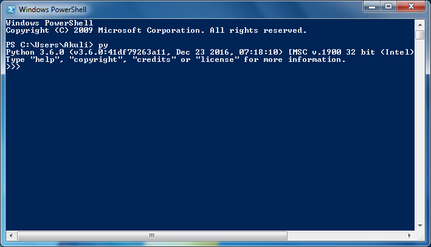

# Instalación de Python

## Descargando e instalando Python

### Windows

Instalar Python en Windows es muy parecido a instalar cualquier otro programa.

1. Vaya al [sitio web oficial de Python](https://www.python.org/).
2. Mueva el mouse sobre el botón azul Descargas, pero no haga clic en él.
   Luego haga clic en el botón que descarga la última versión de Python.
3. Ejecute el instalador.
4. Asegúrese de que el lanzador esté instalado y haga clic en Instalar ahora.

   

### Mac OS X

Al momento de escribir esto, las Mac no vienen con Python 3 y usted
necesita instalarlo usted mismo. Debería ser como instalar cualquier otro
programa, pero desafortunadamente no tengo mejores instrucciones porque
no tengo una Mac actualizada y nunca he instalado Python en una Mac.
Si desea escribir mejores instrucciones, [diga
yo](../contact-me.md).

## Linux

Ya tienes Python 3, **no es necesario instalar nada**. Tú
también puede tener Python 2, pero no intente eliminarlo.
Algunos de los programas que venían con su sistema operativo
probablemente están escritos en Python 2, por lo que eliminar Python 2 sería
romperlos.

## Ejecutando Python

A continuación, aprenderemos a ejecutar Python en un PowerShell o terminal. Existen
varias otras formas de ejecutar Python, pero si aprende de esta manera ahora es
va a hacer las cosas más fáciles más tarde.

### Windows

1. Abra un PowerShell desde su menú de inicio o pantalla de inicio.
2. Escribe `py` y presiona Enter. Debería ver algo como esto:

   

Ahora debería tener Python instalado y debería poder ejecutarlo.
