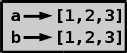

# Listas y tuplas

## ¿Por qué debemos usar listas?

A veces podemos terminar haciendo algo como esto.

```python
name1 = 'Carlos'
name2 = 'Pepe'
name3 = 'Camila'
name4 = 'Juliana'
name5 = 'Steven'

name = input("Enter your name: ")
if name == name1 or name == name2 or name == name3 or name == name4 or name == name5:
    print("I know you!")
else:
    print("Sorry, I don't know who you are :(")
```

Este código funciona bien, pero hay un problema. El control del nombre
es repetitivo, y agregar un nuevo nombre requiere agregar aún más
comprobaciones repetitivas y aburridas.

## Nuestra primera lista

En lugar de agregar una nueva variable para cada nombre, podría ser
mejor almacenar todos los nombres en una variable. Esto significa que nuestro
una variable necesita apuntar a múltiples valores. Una manera fácil de
haz esto usando una lista:

```python
names = ['Carlos', 'Pepe', 'Steven', 'Camila', 'Juliana']
```

Aquí la variable `names` apunta a una lista, que luego apunta al string.

Este es un ejemplo similar:


## What can we do with lists?

Abramos el prompt `>>>` y creemos una lista de nombres.

```python
>>> names = ['Carlos', 'Pepe', 'Camila', 'Juliana', 'Steven']
>>> names
['Carlos', 'Pepe', 'Camila', 'Juliana', 'Steven']
>>>
```

```python
>>> len(names)   # len es la longitud corta, tenemos 5 nombres
5

```

Con la indexación y el corte de strings, ambos devolvieron un string, pero
con listas obtenemos una nueva lista cuando estamos cortando y un elemento
de la lista si estamos indexando.

```python
>>> names[:2]    # Primeros dos nombres
['Carlos', 'Pepe']
>>> names[0]     # primer nombre
'Carlos'
>>>
```

Si queremos comprobar si el programa sabe un nombre todo lo que necesitamos para
hacer es usar la palabra clave `in`.

```python
>>> 'lol' in names
False
>>> 'Camila' in names
True
>>>
```

No podemos usar esto para verificar si una lista de nombres es parte de
nuestra lista de nombres.

```python
>>> ['Camila', 'Juliana'] in names
False
>>> ['Camila'] in names
False
>>>
```

Algunos de los más utilizados son agregar, extender y eliminar.
`append` agrega un elemento al final de una lista, `extend` agrega
varios elementos de otra lista y `remove` elimina un elemento.

```python
>>> names
['Carlos', 'Pepe', 'Camila', 'Juliana', 'Steven']
>>> names.remove('Pepe')
>>> names.remove('Juliana')
>>> names
['Carlos', 'Camila', 'Steven']
>>> names.append('Miguel')    # añadimos a Miguel
>>> names
['Carlos', 'Camila', 'Steven', 'Miguel']
>>> names.extend(['Juliana', 'Pepe'])  # wb guys
>>> names
['Carlos', 'Camila', 'Steven', 'Miguel', 'Juliana', 'Pepe']
>>>
```

Tenga en cuenta que `remove` elimina solo la primera coincidencia que encuentra.

```python
>>> names = ['Pepe', 'Juliana', 'Pepe']
>>> names.remove('Pepe')
>>> names    # El segundo que es Pepe sigue ahi
['Juliana', 'Pepe']
>>>
```

Si necesitamos eliminar todos los elementos coincidentes, podemos usar un ciclo while simple.

```python
>>> names = ['Pepe', 'Juliana', 'Pepe']
>>> while 'Pepe' in names:
...     names.remove('Pepe')
...
>>> names
['Juliana']
>>>
```

Otra cosa útil acerca de las listas es la **comprensión de listas**.
Es una forma práctica de construir una lista en una sola línea. A menudo hace que el código sea más limpio, más corto y más fácil de leer.

```python
>>> numbers = [1,2,3,4,5]
>>> numbers_squared = [number ** 2 for number in numbers]
>>> numbers_squared
[1, 4, 9, 16, 25]
>>>
```

Sin una lista de comprensión, hacer lo mismo se ve así:

```python
>>> numbers = [1,2,3,4,5]
>>> numbers_squared = []
>>> for number in numbers:
...     numbers_squared.append(number**2)
>>> numbers_squared
[1, 4, 9, 16, 25]
>>>
```

También podemos cambiar la indexación y modificar el contenido:

```python
>>> names = ['Pepe', 'LOL', 'Camila', 'Juliana', 'Steven']
>>> names[1] = 'Carlos'   # remplaza LOL con Carlos
>>> names
['Pepe', 'Carlos', 'Camila', 'Juliana', 'Steven']
>>>
```

Como puede ver, **la lista se puede cambiar en el lugar**. En otra
palabras, son **mutables**. Enteros, flotantes, cadenas y muchos
otros tipos integrados no pueden, por lo que son **inmutables**.

```python
>>> names = names.remove('Miguel')
>>> print(names)     # ahora es None
None
>>>
```

## ¿Que es que?

Después de trabajar con listas por un tiempo, descubrirá que
comportarse así:

```python
>>> a = [1, 2, 3]
>>> b = a
>>> b.append(4)
>>> a    # ¿Esto tambien cambio?
[1, 2, 3, 4]
>>>
```

Esto puede ser confuso al principio, pero en realidad es fácil de
explique. El problema con este ejemplo de código es `b = a`
línea. Si hacemos un dibujo de las variables se ve así:


Aquí es cuando entra en juego la palabra clave `is`. Se puede usar para
comprueba si dos variables apuntan a **lo mismo**.

```python
>>> a is b
True
>>>
```

Escribir `[]` crea una lista **nueva** cada vez.

```python
>>> [] is []
False
>>> [1, 2, 3] is [1, 2, 3]
False
>>>
```

Si necesitamos **una nueva lista con contenido similar** podemos usar el
método `copy`.

```python
>>> a = [1, 2, 3]
>>> b = a.copy()
>>> b is a
False
>>> b.append(4)
>>> b
[1, 2, 3, 4]
>>> a
[1, 2, 3]
>>>
```

Si dibujamos una imagen de nuestras variables en este ejemplo, parece
como esto:



## tuplas

Las tuplas se parecen mucho a las listas, pero son inmutables, por lo que
no se puede cambiar en el lugar. Los creamos como listas, pero
con `()` en lugar de `[]`.

```python
>>> thing = (1, 2, 3)
>>> thing
(1, 2, 3)
>>> thing = ()
>>> thing
()
>>>
```

Si necesitamos crear una tupla que contenga solo un elemento,
necesita usar `(elemento,)` en lugar de `(elemento)` porque `(elemento)` es
usado en lugares como `(1 + 2) * 3`.

```python
>>> (3)
3
>>> (3,)
(3,)
>>> (1 + 2) * 3
9
>>> (1 + 2,) * 3
(3, 3, 3)
>>>
```

También es posible crear tuplas simplemente separando las cosas con
comas y sin agregar paréntesis. Personalmente no me gusta esta característica,
pero a algunas personas les gusta hacerlo de esta manera.

```python
>>> 1, 2, 3
(1, 2, 3)
>>> 'hello',
('hello',)
>>>
```

Las tuplas no tienen métodos como agregar, extender y eliminar
porque no pueden cambiarse a sí mismos en el lugar.

```python
>>> stuff = (1, 2, 3)
>>> stuff.append(4)
Traceback (most recent call last):
  File "<stdin>", line 1, in <module>
AttributeError: 'tuple' object has no attribute 'append'
>>>
```
