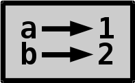

# Variables, Booleanos
## Variables

Las variables son fáciles de entender. Simplemente **señalan valores**.

```python
>>> a = 1 # crea una variable llamada a que apunte a 1
>>> b = 2 # crea otra variable
>>> a # obtiene el valor al que apunta la variable
1
>>> segundo
2
>>>
```

Dibujemos un diagrama de estas variables.



También podemos cambiar el valor de una variable después de configurarla.

```python
>>> a = 2 # hacer un punto a 2 en lugar de 1
>>> a
2
>>>
```

Así que ahora nuestro diagrama se ve así:


Establecer una variable en otra variable obtiene el valor de la otra
variable y establece la primera variable para que apunte a ese valor.

```python
>>> a = 1
>>> b = a  #  esto hace que b apunte a 1, no a
>>> a = 5
>>> b      # b no cambió cuando a cambió
1
>>>
```

Las variables son simples de entender, pero hay algunos detalles que
hay que tener en cuenta:

- Las variables siempre apuntan a un valor, **nunca apuntan a otra variable**. Es por eso que las flechas en nuestros diagramas siempre van hacia la izquierda.
  a derecha.
- Múltiples variables pueden apuntar al mismo valor, pero una variable
  no puede apuntar a varios valores.

Las variables son una parte importante de la mayoría de los lenguajes de programación y
permitir a los programadores escribir programas mucho más grandes de lo que podrían escribir
sin variables

Los nombres de variables distinguen entre mayúsculas y minúsculas, como muchas otras cosas en Python.

```python
>>> thing = 1
>>> THING = 2
>>> thIng = 3
>>> thing
1
>>> THING
2
>>> thIng
3
>>>
```

También hay palabras que no se pueden usar como nombres de variables.
porque están reservados por el propio Python y tienen un significado especial.
Se llaman **palabras clave**, y podemos ejecutar `help('keywords')`
para ver la lista completa si queremos.
Aprenderemos a usar la mayoría de ellos más adelante en este tutorial. Tratando de usar un
palabra clave como nombre de variable provoca un error de sintaxis.

```python
>>> if = 123
  File "<stdin>", line 1
    if = 123
       ^
SyntaxError: invalid syntax
>>>
```

Al asignar algo a una variable usando `=`, el lado derecho de
el `=` siempre se ejecuta antes del lado izquierdo. Esto significa que podemos
hacer algo con una variable en el lado derecho, luego asignar el resultado
de vuelta a la misma variable en el lado izquierdo.

```python
>>> a = 1
>>> a = a + 1
>>> a
2
>>>
```

Para hacer algo con una variable (por ejemplo, para agregarle algo)
también puede usar `+=`, `-=`, `*=` y `/=` en lugar de `+`, `-`, `*` y
`/`. Los "avanzados" `%=`, `//=` y `**=` también funcionan.

```python
>>> a += 2          # a = a + 2
>>> a -= 2          # a = a - 2
>>> a *= 2          # a = a * 2
>>> a /= 2          # a = a / 2
>>>
```

Esto no se limita a números enteros.

```python
>>> a = 'hello'
>>> a *= 3
>>> a += 'world'
>>> a
'hellohellohelloworld'
>>>
```

Ahora también entendemos por qué escribir hola en el aviso no funcionó en
el comienzo de este tutorial. Pero podemos asignar algo a un
variable llamada hola y luego escriba hola:

```python
>>> hello = 'hello there'
>>> hello
'hello there'
>>>
```

## Nombres de variables buenos y malos

Los nombres de las variables pueden tener varios caracteres. pueden contener
mayúsculas, números y algunos otros caracteres, pero la mayoría de los
tiempo debemos usar nombres de variables simples y en minúsculas. También podemos usar
guiones bajos Por ejemplo, estos nombres de variables son buenos:

```python
>>> magic_number = 123
>>> greeting = "Hello World!"
>>>
```

No use nombres de variables como este, **estas variables son _malas_**:

```python
>>> magicNumber = 3.14
>>> Greeting = "Hello there!"
>>> x = "Hello again!"
>>>
```
